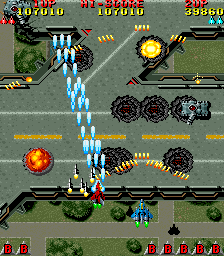

# Raiden Remake
EDA Personal Project - Raiden Game



### Setup:
These instructions will get a copy of the project running on your local machine.

### Installing 

After you have pulled down the repo:

```
cd raiden-remake
npm start
```

# Goals of this project.
- Create a raiden like game: https://www.youtube.com/watch?v=Xe_5zxXiQAs 
- Will use a Daniel Shiffman P5.js space invader example. https://www.youtube.com/watch?v=biN3v3ef-Y0&t=1212s
- Have a solid understanding of how the code works
- Convert code to ES6 Standard:  https://developer.mozilla.org/en/docs/Web/JavaScript/Reference/Classes
- Make the game 'my own' will add sprite images, background scrolling and sound effects.
- Convert web app into an desktop electron app.


